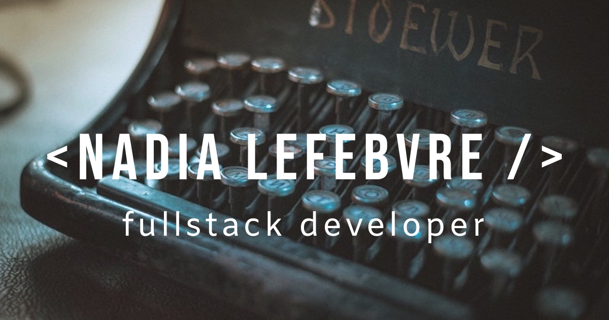

# Hello! I’m Nadia, fullstack developer 👋

### Skilled fullstack developer with experience in React/Node.js and a background as a language specialist, I bring structure, attention to detail, strong communication skills, and a passion for solving problems. I am a quick learner, always eager to improve and take on new challenges. My goal is to create impactful products that matter and contribute to a knowledge-sharing culture.

  

### 🌱 I graduated from [Technigo](https://www.technigo.io "Technigo")'s web development bootcamp (class of January '22) with focus on JavaScript, React and Node.js, but since then, I'm sharpening and broadening my tech skills, especially with TypeScript.
### 📚 My portfolio is [available here](https://nadialefebvre.dev/ "Nadia Lefebvre - portfolio").
### 💼 You can find me [on LinkedIn](https://www.linkedin.com/in/nadiainsweden/ "Nadia Lefebvre - LinkedIn"), or reach me [via email](mailto:dev.nadialefebvre@gmail.com "Nadia Lefebvre - email").
 

  
## 🛠 Languages and tools

  
  &nbsp;
  &nbsp;
  
  &nbsp;
  &nbsp;
  
  &nbsp;
  &nbsp;
  
  &nbsp;
  &nbsp;
  
  &nbsp;
  &nbsp;
  
  &nbsp;
  &nbsp;
  
  &nbsp;
  &nbsp;
  
  &nbsp;
  &nbsp;
  
  &nbsp;
  &nbsp;
  
  &nbsp;
  &nbsp;
  
  &nbsp;
  &nbsp;
  
  &nbsp;
  &nbsp;
  
  &nbsp;
  &nbsp;
  
  &nbsp;
  &nbsp;
  <a href="https://github.com/nadialefebvre?tab=repositories">
    &nbsp;
  </a>
  &nbsp;
  &nbsp;
  
  &nbsp;
  &nbsp;
  <a href="https://github.com/nadialefebvre?tab=repositories">
    &nbsp;
  </a>
  &nbsp;
  &nbsp;
  

